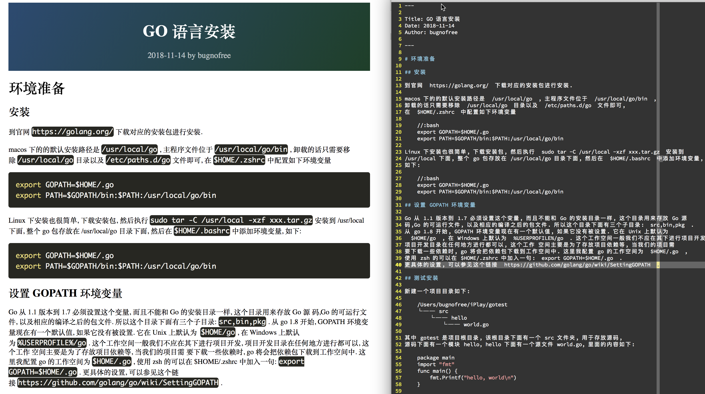
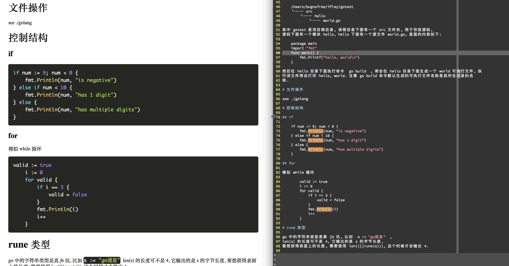

# pigger

用 golang 编写的静态博客生成器

# 项目简介

写该项目有如下几个原因:

- 实践 golang 语言
- 希望写一个适合自己的, 可以自定义的静态博客生成器, 其功能应该有如下几个
    - 基于 markdown 语法并做适当扩展
    - 博文应该是文本友好型, 也就是说, 一篇博文, 在浏览器中和用文本编辑器打开时,
    都能够给人带来舒适的阅读体验, 因此对文本书写格式有要求,
    但是 markdown 语法还是略显复杂
    - 不支持表格, 因为文本不友好
    - 在保证渲染一致的情况下, 能够生成单 HTML 页面以及导出为 PDF

本项目是本人边学习 hugo 源码而开发的个人项目.


# TODO

- 实现文本到简单 html 的渲染 (✓)
- 解析文章头(标题, 作者, 时间) (✓)
- 实现列表的渲染
- 修复代码块中不能有空行的问题
- 捆绑静态资源(css, js 等) (✓)

# 格式

- 不支持表格, 因为单独打开文本进行查看的时候不方便

- 代码格式化

    行内格式化使用两个空格将待格式化文本包括起来, 如 `  const var a = 10;  `,
    如果想使用一整段代码, 则可以使用 tab 缩进(四个空格), 比如

    ```
    #include <iostream>
    using namspace std;
    int main() {
        cout << "Hello pigger" << endl;
        return 0;
    }
    ```

行内格式化不采用 markdown 的反单引号和三个反引号标记, 因为文本不友好.

- 文章元信息(meta info)

    在文章开头处用 `---` 组成一个节区, 写入相关信息, 可写的信息如下,
    标 `*` 的表示必选

    ```
    ---
    - Title: *
    - Author:
    - Date:
    - Url:

    - Topic:
    - Keyword:
    ---
    ```

- 链接

    使用 `@<somthing>` 表示一个链接, 可以是本地的也可以是远程的,
    如果是本地的, 文件将会被拷贝到静态目录里面, 然后上传到远程服务器上,
    @ 会被渲染成一个链接.

# 其他特殊要求

- 最后一行必须为空行
    

# 架构设计

```
// 静态资源
etc/   # pigger 系统配置文件
   ├── css/
   │   ├── normalize.css
   │   └── pigger.css
   └── themes/
       └── default.json

// 新建目录
SITE/
    3w/         # 输出目录
        css/
        images/ # 图片
        videos/ # 视频
        aritcle-demo.html # 生成的样例文章
        text-demo.html # 生成的样例文章
        tmp/ # 临时文件
        index.html # 首页
    home/ # 写作平台
        usr/  # 用户配置文件, 可以覆盖或扩展 pigger 系统配置
            css/
            themes/
        assets/
            images/
            videos/
        md-demo.md # markdown 文件
        text-demo.txt # 文本文件
        draft/ # 草稿文件, 生成 html 时将会跳过
            drft-demo.md
```

用户只需要保留 `usr/` 和 `home/` 目录即可, 可以方便的实现迁移.

# 样例文章

```
---
title: link and loader - an introduction for human
date: 2018-11-02
author: bugnofree
type: md, txt
---

ELF 将 GOT 拆封为两个表:

- .got: 该数组依次存放全局变量的引用地址
- .got.plt: 该数组依次存放函数的引用地址, 该数组的前三个元素如下
    - .got.plt[0]: 保存 .dynamic 地址
        - hello world
            - hello world
    - .got.plt[1]: 保存 link_map 指针
    - .got.plt[2]: 保存 _dl_runtime_resolve 函数地址

其余的每一项均保存外部函数的引用.

插入图片: @sample.png

插入连接: @https://www.google.com

插入公式: $a^2+b^2=c^2
```

# 效果预览




