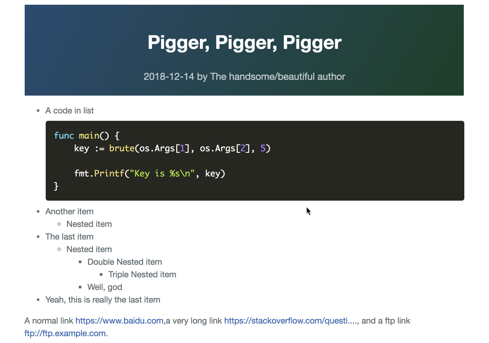
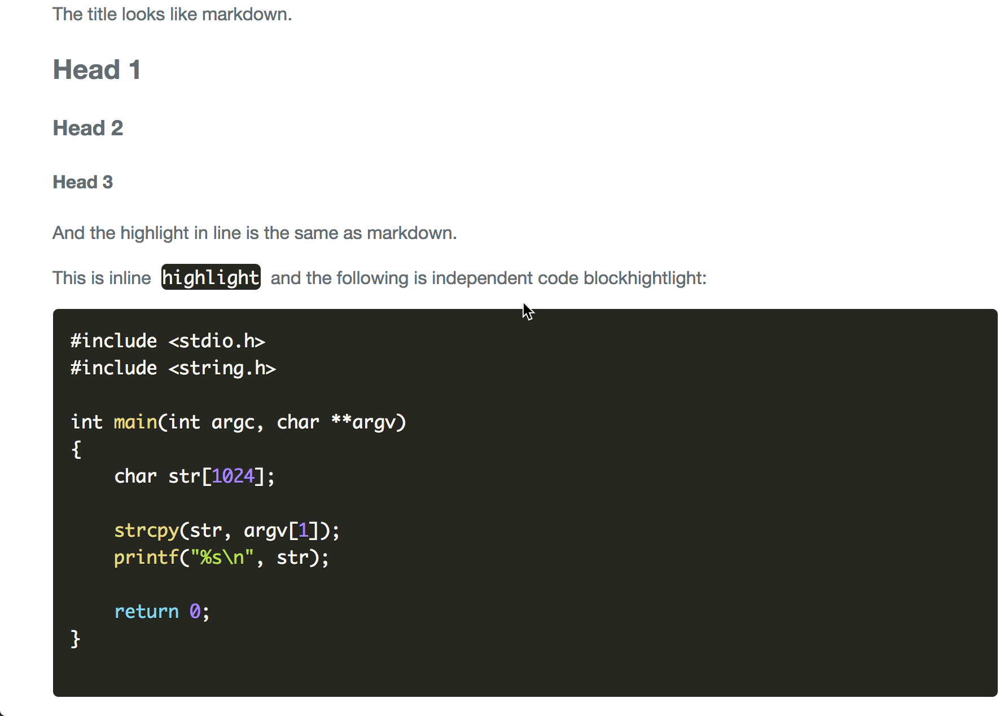

---

A Chinese version could be found [here](./docs/README-CN.md).  中文版本在 [这里](./docs/README-CN.md).

---

# Pigger - A cross-platform static blog generator

You may say `Wow, how ugly is the logo!` Well, I want to make a great logo, as well.

# Why pigger?

Write concise and well organized notes is an excellent habit when you learn something.
For a long time, I am seeking a way which could make note taking easy.
What I have tried has `M$ series such as word office`, `Markdown`, `XeLaTex`,
`HTML` and so on. I have also experienced many blog systems, few of them will satisfy my demand.

In my opinion, a quick note taking system should be

- **Free and open sourced.** The user may customize if they can.
- **Cross platforms.** This includes both the note taking system and generated things by the
    system, and the supported platform should at least include `linux, windows, macos`.
- **Note should be simple.** No tables, no equations and not too much images. You may argue
    that, I agree with what you want to say. Everyone has his/her own choice.
- **Note should be well organized.** An argument point should be separated from others.
    Whatever you reads the primitive note or rendered note, both they should be clear.

And the finally, I select `text` as the format of note and, of course, my `pigger`.
You do not need to learn too much, the organization of `pigger` document looks like
markdown, but is more simpler than markdown.

Do not worry about `pigger` at all, if you want to try then you can, I promise.

# How to install?

## The easy way

Just download from the project release page, unzip it and add the binary path into your
environment.

## The hard way

Firstly, of course, you should install [go](https://golang.org/).

Two go packages for now are used in this project, you can install them using
following commands:

    go get -u github.com/gobuffalo/packr/packr
    go get -u github.com/gobuffalo/packr
    go get -u github.com/json-iterator/go

Everything is got prepared!  You can run `make` then your are done.
One more thing, if you have installed [gox](https://github.com/mitchellh/gox),
you can run `make release` to build binary for linux, mac and window platforms.

# How to use?

To get a feeling of `pigger`, lets build a demo!

Use your favorite text editor(may not a windows notepad, please), new a blank text document,
lets say `demo.txt`, and fill it with following text:

    ---
    title: Pigger, Pigger, Pigger
    date: 2018-12-14
    author: The handsome/beautiful author
    ---

    - A code in list
            //:go
            func main() {
                key := brute(os.Args[1], os.Args[2], 5)

                fmt.Printf("Key is %s\n", key)
            }
    - Another item
        - Nested item
    - The last item
        - Nested item
            - Double Nested item
                - Triple Nested item
            - Well, god
    - Yeah, this is really the last item

    A normal link @[https://www.baidu.com],
    a very long link @[https://stackoverflow.com/questions/40821855/do-go-switch-cases-fallthrough-or-not].
    , and a ftp link @[ftp://ftp.example.com].

    You say, you want to insert an image, its ok: @[./book-reading.jpg]

    The title looks like markdown.

    # Head 1
    
    ## Head 2
    
    ### Head 3

    And the highlight in line is the same as markdown.

    This is inline `highlight` and the following is independent code block
    hightlight:

        #include <stdio.h>
        #include <string.h>

        int main(int argc, char **argv)
        {
            char str[1024];

            strcpy(str, argv[1]);
            printf("%s\n", str);

            return 0;
        }

Now, run `pigger demo.txt`, its output looks like

    ➜  pigger (master) ✗ pigger demo.txt
    Save file into /path/to/demo/index.html

and the structure of demo looks like:

    ➜  pigger (master) ✗ tree demo
    demo
    ├── css
    │   ├── normalize.css
    │   ├── pigger.css
    │   └── prism.css
    ├── images
    │   └── book-reading.jpg
    ├── index.html
    ├── index.html.txt
    ├── js
    │   └── prism.js
    └── tpl
        └── site.html

    4 directories, 8 files

You can send this directory to anyone, the receiver can open his/her browser to view it.
Not every should have a MS word office, but everyone should have a browser, right?

`Pigger` not only generates standalone article from neat text file, but also builds
concise website for you! I will mention the full usage of `pigger` soon.

The screenshot of the generated html pages is showed as below

Do you like pigger? Good, Just have a try!

# Want to see a demo?

A demo site is here: [http://ahageek.com/writer/site.html](http://ahageek.com/writer/site.html).

# Pigger Document Format

## Paragraph

`pigger` will split the text file into paragraphs according to blank line.
However, blank line may appear in the code block, `pigger` will detect and deal with this
in a smart way.

## Title

Using `#` for first-level head, `##` for second, `###` for third and so on.

For each note, there should give a head section which looks like the below.

    ---
    - title: xxx
    - author: xxx
    - date: xxx
    ---

For now, `pigger` only support this three options.

The format of the date must looks like `2018-08-04` which are `year-month-day` sequence.

Year, month, day have four, two, two digits, respectively.

`pigger` will use the date to sort your article if you write blog.

## Highlight

A independent code block is denoted as four-spaces indents.

A list code block is denoted as eight-spaces indents.

Please note that `Tab` will note be regarded as valid indents.

In the first line of code block, you may use `//:<lang>` to denote what highlight
you want to have. For supported language list, see [here](https://prismjs.com/#languages-list).
For example, if you want to have golang highlight, you can write `//:go`.
If you omit highlight declaration, the `clike` scheme is used.

## Link

This is specific to `pigger`. The format is `@[LINK]`, it can be an image or a URL.

If the link starts with `http` or `ftp`, then this will be treated as a URL link.
If the link length is more than `32`, then the link will be truncated to show on the page.

For others, ths link will be regarded as an image path on your local device. In the process of
rendering, `pigger` will copy the image into the generated HTML directory.

# Pigger Usage

    ➜  pigger (master) ✗ pigger --help
    Usage: pigger [[OPTIONS] <infile>]|[ACTIONS PARAMS]
    OPTIONS:
      -h    (optional) Show this help.
      -o string
            (optional) The output directory.
      -style string
            (optional) Specify a remote style root directory.
      -x    (optional) Cut off css and js files.
    ACTIONS:
      build: Build all files
      new <sitename>: Create a new site
      update [style]: Update stuffs for pigger site
             style: update embedded style files such as css, js etc.

As the above output, you can just use `pigger file.txt` to render the file
`file.txt` as a standalone webpages.

You may use `pigger new sitename` to create a site named `sitename`,
Its structure is showed as below:

    ➜  pigger-site (master) ✔ tree -L 2
    .
    ├── home
    │   ├── got-and-plt.txt
    │   ├── images/
    │   ├── kickstart-2018-round-g-problem-a.txt
    │   └── python-modules.txt
    ├── migration
    │   ├── 0ctf-2015-simpleapk/
    │   └── zsh-install-and-config/
    ├── posts
    │   ├── got-and-plt/
    │   ├── kickstart-2018-round-g-problem-a/
    │   ├── pigger/
    │   └── pigger.json
    └── site.html

The `home` is where you should put your notes, every should ends with a `.txt` suffix.

Rendered file will be put into `posts` directory.

`site.html` will be the index file of your site. Why not `index.html`?
For people who wants to make pigger site as their module.

You should not touch `posts`, it is processed by `pigger`.

Yeah, `migration` is used to migrate, you are clever enough!
See more below.

Once you have create a site using pigger, you can run `pigger build` in the root of the
site, and pigger will do everything for you!

# Migration

For now, pigger only supports standalone HTML article migration.
What's that mean?  Lets say you have a article named `awesome-article`,
its structure should look like

    awesome-article/
        |- index.html
        |- images/
        |- other-stuffs

The `index.html` is a must. You should put a `index.json` into `migration`,
`index.json` has the meta info of every article, the format of `index.json` is showed as
below:

    [
        {
            "title": "TITLE"
            "author": "AUTHOR",
            "link": "LOCATION",
            "date": "DATE"
        },
        {
            "title" : "My awesome title",
            "author": "God",
            "link": "awesome-article",
            "date": "2018-12-25"
        }
    ]

The link is the relative path of the article to `migration`.

# Bonus

If you want to view the primitive text file,
you can append a `.txt` to the link of a pigger webpage.
For example, [this](http://ahageek.com/writer/posts/kickstart-2018-round-g-problem-a/index.html) is a page
generated by `pigger`, if you want to view its text file, you can access
[this](http://ahageek.com/writer/posts/kickstart-2018-round-g-problem-a/index.html.txt).

# Support the author

I do not eager for your money.
If you like `pigger`, please **star** it or **fork** it and **contributes**.

# License

MIT License
