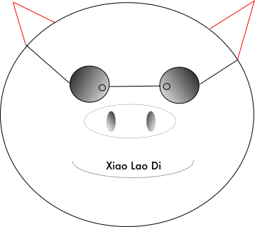

# Pigger - 笔记系统 && 静态博客生成器

## 1. 安装方法

根据自己的平台选择下载如下软件

- windows → [pigmgr_windows_386](https://github.com/ikey4u/pigger/releases/download/v1.0.4/pigmgr_windows_386)
- mac → [pigmgr_darwin_amd64](https://github.com/ikey4u/pigger/releases/download/v1.0.4/pigmgr_darwin_amd64) 
- linux → [pigmgr_linux_386](https://github.com/ikey4u/pigger/releases/download/v1.0.4/pigmgr_linux_386) 

下载后命令行执行即可完成安装.

## 2. 文档格式(只有一页)

    
高清无码 PDF 看[这里](https://raw.githubusercontent.com/ikey4u/pigger/master/docs/demodoc.pdf)

## 生成笔记

样例笔记: [http://ahageek.com/writer/posts/msb-and-lsb/index.html](http://ahageek.com/writer/posts/msb-and-lsb/index.html)

你可以在链接后面加上一个 `.txt` 打开源文件:
[http://ahageek.com/writer/posts/msb-and-lsb/index.html.txt](http://ahageek.com/writer/posts/msb-and-lsb/index.html.txt) 

生成笔记很简单, 假设这个文本文件的名称为 msb-and-lsb.txt,  那么要生成如上效果只需如下命令:

    pigger msb-and-lsb.txt

然后打开当前目录下面的文件 `msb-and-lsb/index.html` 即可看到效果.

## 生成博客

样例博客: [http://ahageek.com/writer/site.html](http://ahageek.com/writer/site.html)

生成静态博客(假设博客目录为 writer), 只需要执行下面一条命令

    pigger new writer

就生成了一个静态博客.

在 writer 目录下面按照 pigger 的文档格式写个文本文件, 必须以 .txt 为后缀.

    windows 用户注意, 不要用系统自带的文本编辑器, 找一个好用一点的如 notepad++,
    vs code editor 等, 文本格式应该是 unix 类型的, 看自己的编辑器调整一下.

最后执行

    pigger build

上面这条命令就渲染了所有的文本到 html,
然后把这个博客目录扔到 github 的二级子域名上,
然后访问 xxx.github.io/site.html 就可以了.

# Support ?

# License

MIT License
