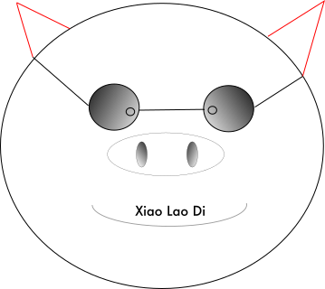

# Pigger - 一个跨平台的静态博客生成器



# 为什么写 Pigger?

制作一个笔记系统, 该笔记系统应该有如下功能:

- 完全免费且开源
- 跨平台
- 笔记格式应该是简单的
- 笔记应该是层次分明的

还有我自己的记笔记心得, 有时间再写.

# 功能

- 待实现功能
    - Windows, Linux, MacOS 一键安装包
    - 渲染页面添加 footer, 放置版权信息
    - 静态博客文章添加主页按钮
    - 添加用户自定义样式文件
    - 实时渲染服务(计划采用 fsnotify 库实现)
    - 导出 PDF
- 基本功能
    - 文本到 HTML 的渲染 (✓)
    - 文章头(标题, 作者, 时间)解析 (✓)
    - 无限级别嵌入列表的渲染 (✓)
    - 捆绑静态资源实现代码高亮(css, js 等)(✓)
    - 行内代码块渲染(✓)
    - 独立代码块高亮渲染(✓)
    - 列表内代码块渲染(✓)
    - HTML 标记转义(✓)
    - UTF-8 字符处理(✓)
    - 代码块空行功能(✓)
- 特色功能
    - 文章标题自动编号, 如 1, 1.1, 1.1.1, 2, 2.1 等 (✓)
    - 显示文章发布时间和最近一次更新时间(✓)
    - `@` 语法自动插入图片(支持 .gif, .png, .jpg, .jpeg, .svg 图片后缀)功能,
        该图片可以是本地的任意绝对路径或相对路径, 图片将会自动拷贝到渲染目录(✓)
    - `@` 语法插入超链接功能(除去检测上述图片外, 其他的均视作一个超链接),
        如果链接长度超过 32, 则后续部分以三个省略号来表示 (✓)
    - 单篇文章生成(✓)
    - 简单静态博客生成 (✓)
    - 其他博客文章迁移到 pigger 静态博客(✓)
    - 更新内置样式(目前是从程序安装包内更新, 非远程更新)(✓)
    - 方便查看文章源文件, 只需在文章链接末尾加上一个 `.txt` 后缀, 即可查看原来的文本文件(✓)
    - 设置缺省标题(✓)
- 缺失功能
    - 对于类似于 bash 中的 here doc 从文本复制时, 需要注意前缀空格不能有, 需要块复制.

# 书写格式

- 只支持文本文件(必须以 `.txt` 为后缀)

- 不支持表格, 因为单独打开文本进行查看的时候不方便

- 列表渲染

    列表的第一行如果末尾字符为冒号(忽略右侧空格), 则表示换行,
    也就是说此时列表的第一行作为一个简短的小标题.

- 代码格式化

    行内格式化时使用两个反斜号将待格式化的文本括起来,
    如果想在行内显示一个反斜号, 请务必保证该行只有一个反斜号.

    如果想使用一整段独立的代码, 则可以缩进四个空格(请注意, 不支持 tab!),
    第一行可以使用 `//:` 来指明高亮的语言, 该行在实际显示时将会被忽略,
    该行是可选的, 默认的高亮采用的是 C 语言家族. 比如

    ```
    //: c++
    #include <iostream>
    using namspace std;
    int main() {
        cout << "Hello pigger" << endl;
        return 0;
    }
    ```

    列表中也可以使用代码块, 比当前列表项多 8 个空格缩进即可.

- 文章元信息(meta info)
    在文章开头处用 `---` 组成一个节区, 写入相关信息, 目前只允许写如下信息

    ```
    ---
    - title: *
    - author: *
    - date: *
    ---
    ```

    日期的格式必须是 `年-月-日`, 比如 `2018-08-04`, 位数依次为 4, 2, 2 位.
    对于静态博客站点, 将按照该时间格式将最新的文章放在最前面.

- 链接

    使用 `@[url]` 表示一个链接,
    自动识别的后缀为 .gif, .png, .jpg, .jpeg, .svg 的为图片,
    渲染成一个 `</img>` 标签, 其他的将会被渲染成一个 `<a></a>` 标签.

# pigger 用法

## 基本用法(TODO)

## 单篇文章生成

- 生成一篇完全独立的文章(适合分发)

  是指一篇文章包含了所有所需的资源: 样式表, 脚本文件, 图片文件, 方便分发.
  这也是默认模式.

- 生成一篇半独立的文章(适合写自定义博客文章, `待完善, 不建议使用`)

  使用 `-x` 选项启用该模式, 该模式下, 渲染结果只包含文章用到图片文件,
  文章用到的样式表和脚本文件位于远程服务器上面.

  样式表和脚本文件的必须位于同一目录, 可以通过 `--style <remote url>` 指定.
  `<remote url>` 可以是一个相对路径, 绝对路径或者远程链接.

  无论是哪一种路径, 声明的目录下面均要包含专用文件夹 `css` 和 `js`.
  专用文件夹只支持单级目录


# 博客迁移

从其他平台迁移过来后, 应该将所有文章放置到 pigger 静态博客根目录下面的 migration 目录中,
并且在其下有一个 index.json, index.json 中的每个元素包含了一篇文章元信息.
元信息包含: 文章名称, 文章文件相对于 migration 的位置, 文章日期, 文章作者,
比如

    {
        {
            "title": "TITLE"
            "author": "AUTHOR",
            "link": "LOCATION",
            "date": "DATE"
        }
    }


# 编译

## 安装依赖项

    go get -u github.com/gobuffalo/packr/packr
    go get -u github.com/gobuffalo/packr
    go get github.com/mitchellh/gox


## 安装 pigger

- 执行 `make` 将会在本地编译安装.
- 执行 `make release` 将会编译生成 linux, windows, mac 三个平台的安装包并在本地安装.
